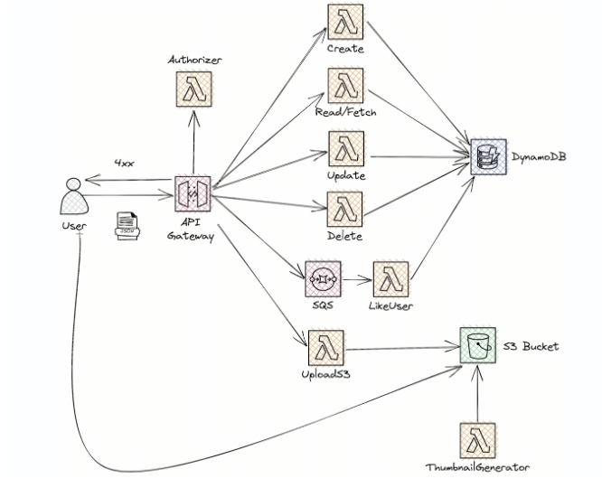

# 🚀 Proyecto Serverless con AWS Lambda, API Gateway, DynamoDB y S3

Este proyecto implementa una arquitectura **serverless** en AWS utilizando **API Gateway**, **AWS Lambda**, **DynamoDB**, **S3**, y **SQS**.  
El objetivo es exponer un API CRUD seguro, con manejo de usuarios, subida de archivos e integración con generación de thumbnails.

---

## 🛠️ Arquitectura



- **API Gateway**: Puerta de entrada para los clientes (usuarios, Postman, frontend).  
- **Custom Authorizer (Lambda)**: Valida tokens/API Keys para controlar el acceso.  
- **Lambdas CRUD**:
  - `Create`, `Read/Fetch`, `Update`, `Delete` → gestionan información en **DynamoDB**.  
- **UploadS3 Lambda**: Maneja subida de archivos a **S3 Bucket**.  
- **ThumbnailGenerator Lambda**: Genera miniaturas de imágenes al detectar un nuevo objeto en el bucket.  
- **LikeUser Lambda + SQS**: Procesa mensajes asincrónicos enviados a través de una cola SQS.  

---

## 📦 Funcionalidades

- ✅ API REST CRUD con DynamoDB.  
- 🔐 Autenticación vía **Custom Authorizer**.  
- 📂 Subida de archivos a S3.  
- 🖼️ Generación automática de thumbnails.  
- 📩 Procesamiento de eventos asincrónicos con SQS.  

---

## 🚀 Despliegue

1. Instalar dependencias:

   ```bash
   npm install
